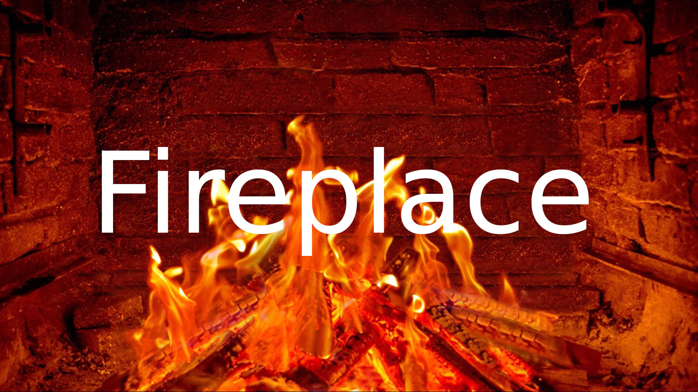

<h1><center>Fireplace</center></h1>

<center></center>

Fireplace is an Web based Tizen app built for Samsung Smart TV. It will simply transform your TV to a cozy fireplace. Several kind of fireplaces are offered. Use your remote to browse among them and find your favorite. As bonus you will be able to earing fire crackling in order to improve realistic effect.

---

<center></center>

---

## :computer: Build it yourself

You must install `Tizen Studio` and configure your certificate for being able to install app to your TV. Please refer to Samsung Developer website in order to follow these prerequesite steps. After that, run following commands :

```bash

# Clone this repo
git clone https://github.com/thonythony/fireplace && cd fireplace

# Install dependencies
npm install

# Build app (in watch mode)
npm run build

# Rub app on your TV
npm run wits-watch

```

## :raising_hand: Contribute

Fireplace is a personal side project that respond to my needs about transforming my TV into a fireplace and used to discover [React](https://reactjs.org/) world.

Probably some bugs are present and bad practices are used. So feel free to contribute by opening a pull request.

A feature is missing, feel free to talk by opening an issue.

## :page_with_curl: Credits & License

This project is only possible with free videos contributions found at [Pixabay](https://pixabay.com/) platform.
This code is released under MIT license.
